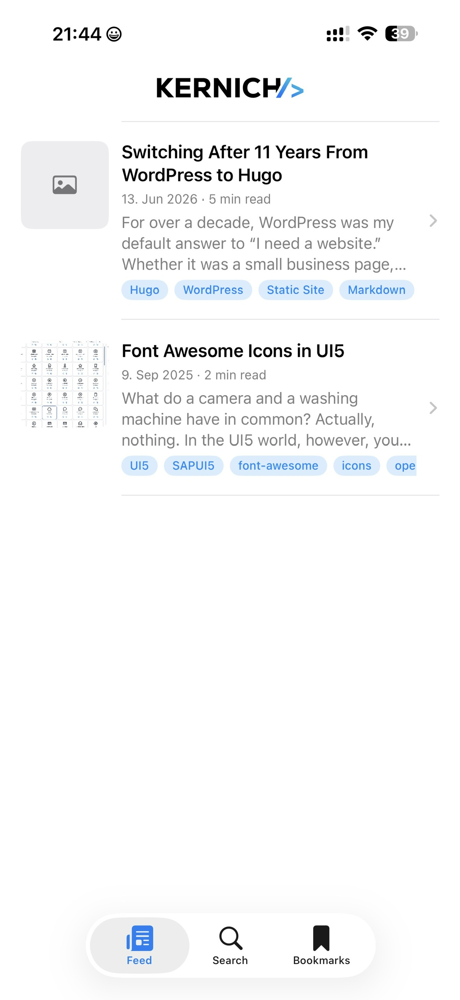

# Kernich Blog

A small SwiftUI iOS reader for the [kernich.de](https://kernich.de) blog.

  

## Features

- Feed, search, and bookmarks tabs
- Native article reader with light/dark theming
- Bundled SVG logo and adaptive app icon (light / dark / tinted)

## Requirements

- Xcode 26+
- iOS 17+

## Build & run

Open `blog.xcodeproj` in Xcode, select an iOS simulator or device, and press **Run** (⌘R).
